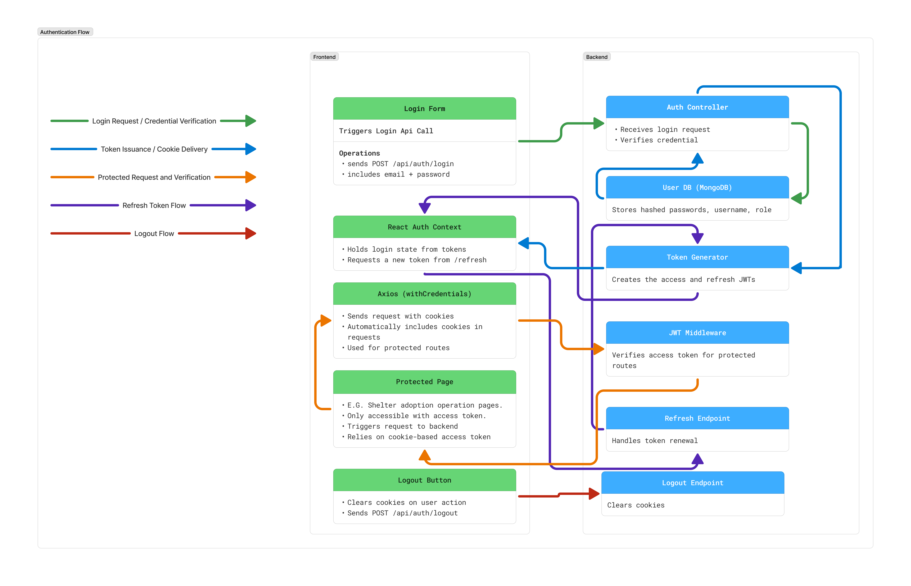

# Authentication System Design Proposal for PetMatch

## Overview

This proposal outlines our authentication strategy for PetMatch, a full-stack MERN application connecting animal shelters with prospective adopters. The platform supports two distinct user roles:

- **Shelters** – must authenticate with our server in order to manage pet listings.
- **Visitors (Users)** – can optionally create accounts to save favorites, message shelters, or track applications, but we will have public endpoints for viewing pets that don't require authentication.

We are prioritizing security and future scalability while maintaining low complexity for MVP development.

## Goals

- Enable secure login and registration for both shelters and users.
- Don't allow access to endpoints with sensitive data without authentication.
- Allow public access to browse pets without authentication.
- Use modern, scalable auth patterns that work well in a MERN stack.
- (optionally) Prepare the architecture to support Google OAuth in future.

## User Roles & Auth Strategy

| Role         | Auth Type                        | Notes                                                                                                         |
| ------------ | -------------------------------- | ------------------------------------------------------------------------------------------------------------- |
| **Shelters** | Email + Password (local auth)    | Secure login required to perform CRUD operations (only on listings that originated from that shelter's login) |
| **Users**    | Email + Password or Google Login | Optional login for messaging/saved pets (planned if time allows)                                              |
| **Public**   | No auth                          | Anyone can browse pets without account                                                                        |

---

## Shelter Account Registration

To maintain trust and security on the PetMatch platform, **shelter accounts cannot self-register via the `/api/auth/register` endpoint**. Instead, shelters must initiate account creation by contacting the PetMatch team directly.

### Workflow

1. A shelter representative submits a request via email to PetMatch support, including:

   - Shelter name and location
   - Official website or social media presence
   - Contact person's name and role
   - Brief summary of shelter’s mission or activity

2. PetMatch admin reviews the request for verification.

3. Once verified, the admin securely creates an account for the shelter using internal tooling and communicates login credentials via encrypted email or onboarding flow.

4. Shelter can then log in via `/api/auth/login` and manage their listings.

5. (Optional) Shelter can change temporary password to one of their own choosing using "change password" feature.

### Why Manual Onboarding?

- Prevents fraudulent shelter accounts
- Ensures credibility and platform integrity
- Reduces complexity for MVP while allowing for future automation

> Future iterations may include an admin dashboard for onboarding shelter accounts or an automated "apply to be a shelter" workflow with verification logic.

---

## Password Storage

- Use `bcrypt` to hash passwords securely before storage. We will NOT be storing plain-text passwords. I've learned that `bcrypt` is slow by design to help thwart brute force attempts as well.
  `bcrypt` gets us 90% of the way there with 10% of the effort, and we can always switch to `argon2id` later if time permits and we want to go HAM on security. But for now, `bcrypt` has a long track record of use, and its easy to implement in our project.

- Store only:
  - `hashedPassword`
  - `userID`
  - `role` (e.g. `"shelter"`, `"user"`)
- <ins>No plain-text or reversible passwords EVER stored, under any circumstance!</ins>

> Optional Upgrade (if time allows): Use `argon2id` for enhanced security

---

## Session & Token Handling

The system uses **stateless authentication via JSON Web Tokens (JWTs)** stored securely in **HTTP-only cookies**, offering a secure and SPA-compatible flow.

| Token Type        | Stored In        | Lifespan | Purpose                                  |
| ----------------- | ---------------- | -------- | ---------------------------------------- |
| **Access Token**  | HTTP-only cookie | 15m      | Used for verifying API requests          |
| **Refresh Token** | HTTP-only cookie | 7–30d    | Used to issue new access tokens silently |

**Why this works:**

- JWTs scale well across stateless APIs
- Cookies are secure with:
  - `HttpOnly`: inaccessible via JavaScript
  - `Secure`: HTTPS-only transmission
  - `SameSite=strict`: blocks CSRF
- Keeps React SPA clean—no need to manually pass tokens in headers

---

## "Refresh" Process For Tokens

To maintain long-lived sessions:

1. On login, issue both access & refresh tokens.
2. Access token expires after 15m.
3. Client uses `/api/auth/refresh` to get a new access token when needed.
4. On logout, clear both tokens from cookies.

---

## OAuth Support (Google Login)

**Planned future feature**: Google OAuth integration for seamless onboarding of visitors. I had considered using passport.js as it abstracts away the complexities of using different OAuth methods, but I think that for the purposes of learning how OAuth works on a fundamental level, manual OAuth is the way to go (if/when we add Google OAuth login)

| Option         | Pros                            | Cons                          | Decision                    |
| -------------- | ------------------------------- | ----------------------------- | --------------------------- |
| `Passport.js`  | Easy drop-in support for Google | Adds abstraction & complexity | _Add later if needed_       |
| `Manual OAuth` | Full control via Google SDK     | More boilerplate              | _Better for learning/setup_ |

For MVP, we focus on manual local auth (email/password). Google login can be integrated via ~~Passport~~ or SDK when needed.

---

## API Route Scaffolding

| Route                | Method | Description                  |
| -------------------- | ------ | ---------------------------- |
| `/api/auth/register` | POST   | Registers new shelter/user   |
| `/api/auth/login`    | POST   | Logs in and sets JWT cookies |
| `/api/auth/refresh`  | POST   | Issues new access token      |
| `/api/auth/logout`   | POST   | Clears auth cookies          |

---

## Folder Structure

/server  
├── /controllers/  
│ └── authController.js # Handles login, register, refresh, logout logic  
│  
├── /routes/  
│ └── authRoutes.js # Defines /api/auth endpoints (POST /login, /register, etc.)  
│  
├── /middleware/  
│ └── authMiddleware.js # Verifies JWTs and protects private routes  
│  
├── /models/  
│ └── User.js # Mongoose schema for users (email, password, role)  
│  
├── /utils/  
│ └── generateTokens.js # Generates access + refresh JWTs  
│  
├── server.js # Mounts auth routes, applies middleware  
└── .env # Stores JWT secrets and config variabless

---

## Visual Flow Diagram

See [`doc/images/auth-flow.png`](../images/auth-flow.png) (or look below) for a high-level overview of the frontend–backend interaction during authentication.

---

## TL;DR Summary

- Email/password login for both shelters and users
- Passwords securely hashed with bcrypt
- JWT-based session management using HTTP-only cookies
- Refresh token flow for long-term login
- Public browsing, private messaging/listing
- Google OAuth planned for future (manual or via Passport)
