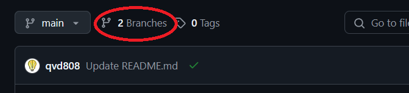
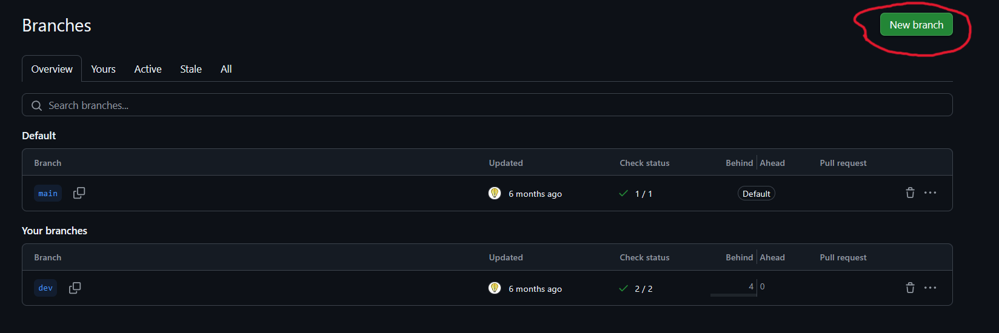
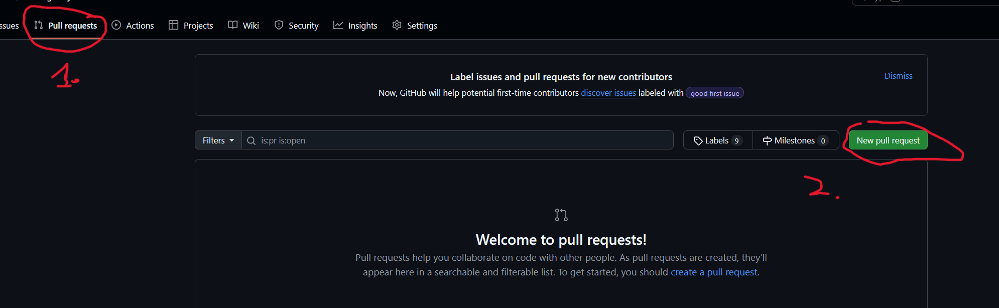
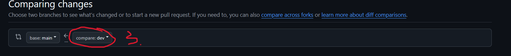

## Overview
This document describes the git workflow that should be used when pushing code to PetMatch. This applies to any developer whether they're working on their personal computer or Github Codespaces.

- **Repository Hosting**: All code is stored on [GitHub](https://github.com/freeCodeCamp-2025-Summer-Hackathon/yellow-packet).

- **Branching Strategy**: We follow the _feature-branch_ model. For which:
  - `main` — stable production-ready branch. **Will reject any direct push request to the main branch**
  - Any developer adding code to the project will be doing it through a feature branch, which will be described in details below

## Workflows
### Making a new branch
The developer will be assigned an issue to work on. When working on the new issue, the developer should create a new branch from `main`. The new feature branch should be named after the issue they work on. For example, if you are working on improving the login page, the feature branch should be named `login-page-improve`. There are no general rules when it comes to naming a branch as long as we understand what the branch will be doing.
You can create a branch by
- Go to your termnal and type (Note: For this to work, you need to be on the main branch, if you are on another feature branch, the history will be from that branch)
```
git checkout -b feature-branch-name
```
- You can follow these steps below to create a branch on GitHub




### Push your commit
After finished your task, you should push your commit to your branch and create a merge request. **Please do not push directly to main, any attemp will be rejected**.
You can create a merge request by going to Pull Requests > New Pull Request > Select your feature branch and merge it to the base branch which is main.




After making a Pull Request, please make sure that:
- Your code has at least one other person to review the code and approve
- Your code is rebased on top the latest main branch
- If you have multiple commits, your code should squash them into a single commit. If you are not sure what squash, merge and rebase mean, please check with other people.

The benefit of this is that it will keep our commits linear and we can always revert a change when a bug is instroduced in a commit. Note that this requires care since if you change code that was originally in the main branch, rebase will introduce a merge conflict. Please communicate with team members carefully if you work on the same branch. Remember, it is okay to have a merge conflict, we just have to solve it sooner instead of letting it grow and rot the codebase.

### Code review
As a developer, working in a team environment, you should practice code review diligiently. Letting bad code be commited to the repo will affect other people who will continue your work. In my opinion, writing code is easy, but writing maintainable code that can be understood by other people is hard, which is why we might need some help from other people. Also, reviewing code helps you have an understanding of the codebase even if you aren't actively working on that feature.

A question you should ask in code review is:
- Why do we need this?
- Does the code correctly implement what is listed in the requirement? In the issue?
- Is the pass criteria acceptable?
- What impact will this bring?
- Is the code easy to understand, and can easily be maintained if someone picks up the code in the future?

You can also follow this [document](https://google.github.io/eng-practices/review/reviewer/looking-for.html) for reference.

### Git tips and trick - Please put here if you have thing you can improve
- You can run the below command in git in your repo to help git run a cron job that will do maintenance for you
```
git maintenance start
```
- When you rebase, you will probally run into **"error: failed to push some refs"**. This can be easily fixed by running git push --force. However, --force is not recommended this since it might overwrite whatever your teammate is working on if you do not pull the commit from the branch. Instead run,
```
git push --force-with-lease
```
This makes sure that you can overwrite the commit if and only if you are the last one that match the ref. This is safer and ensures that you don't overwrite other people's progress.
## Reference
- [Git workflow](https://github.com/asmeurer/git-workflow)
- [So you think you know Git - FOSDEM 2024](https://www.youtube.com/watch?v=aolI_Rz0ZqY)
- [What should you look for in review](https://google.github.io/eng-practices/review/reviewer/looking-for.html)
